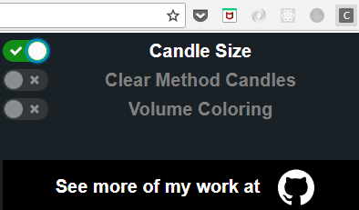

# Coinbase Candle Size Indicator

This project aims to add popular Candle Size Indicator utility to [Coinbase Pro](https://pro.coinbase.com/) via Chrome extension.

## Brief description



* GDAX was great and now (July 2018) it became [Coinbase Pro](https://pro.coinbase.com/). And the name seems to be all that has changed. Unfortunately, all the technical stuff there is on Coinbase is the ability to look at candles instead of line chart. It lacks a lot of useful functionality that other platforms has.
* **Too bad**
* If it had most of [Trading View](https://tradingview.com) functionality, it would probably be unstoppable because of their high security and availability standards. As a developer working on the same stack as they do and a trader-to-be, I'd like to make my contribution to the platform. So here it is.
* **Still work in progress though**

### Installation and usage

After cloning this repository you should go to **Chrome** (or any browser of your choice, but it can act weirdly) and go to:

```
chrome://extensions
```

Then, you should enable **Developer Mode**, upload the

```
CandleSize
|
+- build/ <-- Just this one
```
directory to your browser, go to **Coinbase Pro** and try to turn it on. Hope it'll help making better trading decisions!

## Additional info

This project was bootstrapped with [Create React App](https://github.com/facebookincubator/create-react-app).
